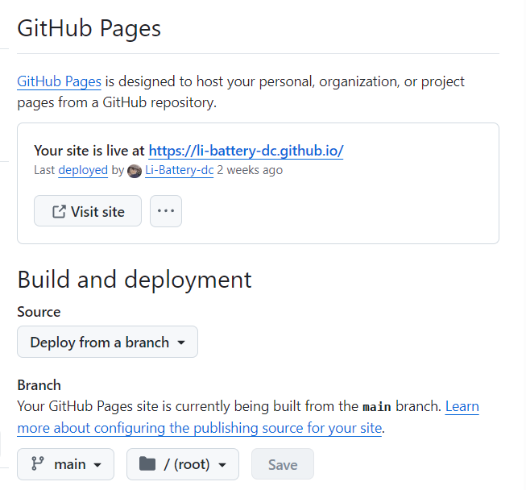

# 【零基础】使用简单的html和css建立简单的个人网站

## 前言

大家在生活中总是会或多或少地记录下一些文字，有时候也会做成公众号文章发表。但是公众号里的模板总是没有自己想要的高级感。那么不如自己设计一个属于自己的个人网站。因为这是一件很cooooooool~的事。

## 具体步骤

### 托管github

拥有一个个人网站需要一系列繁琐的工作，但是github为每一个账户分配了这样一个域名:\<你的username\>.github.io。我们只需要配置代码仓库即可使用。
若没有github账号可以自行注册。

只需要直接在github上新建一个仓库就可以使用这个域名，注意一定要将仓库名命名为你的username（注意不是profile中的昵称name）。现在你已经有了一个个人网站的仓库，只需要在仓库中push你的网站文件即可在*https://<你的username>.gihub.io*访问你的个人网站。或者你可以在你的仓库中的settings->pages看到你的网站的地址，也可以在这里配置网站来源分支。


### 使用html开始编写你的网站

我们将刚刚创建的仓库clone到本地开始编写。
我们可以新建一个文件叫index.html作为网站主页。html文件作为网站的骨架，用于构建网站的结构。

- 一个简单示例：

```html
<!DOCTYPE html>
<html lang="zh-cn">
<head>
    <meta charset="UTF-8">
    <meta name="viewport" content="width=device-width, initial-scale=1.0">
    <title>个人网站</title>
    <link rel="stylesheet" href="styles.css"><!-- 这里指示了所使用的css风格文件。 -->
</head>
<body>
    <header>
        <h1>欢迎来到我的个人网站</h1>
    </header>
    <main>
        <h2>自我介绍</h2>
        <p>我是......</p>

        <h2>最新博客</h2>
        <div class="blog-card">
            <a href="articles/yourArticle.html" class="card-link">
                <div class="blog-card-content">
                    
                    <div class="blog-card-text">
                        <h3>博客</h3>
                        <p>记录所见所闻</p>
                    </div>
                </div>
            </a>
        </div>
    </main>
</body>
</html>
```

在上面的这个简单html代码示例中：

- `<head>`是html文件的一些基本内容，基本可以套用，可以用于链接外部的css风格文件。
- `<header>`是页面的头部区域，可以放标题或者导航栏。
- `<h>`表示各级标题
- `<p>` 是一个段落，用于放主要网站中的主要文字
- `<div>` 定义一个区域，用于分隔和定义各部分。
- `<a>`：定义超链接，用于链接到其他页面或资源。
- ``用于插入图片。

用到这些简单的内容就可以基本搭建好一个html框架，现在可以点开vscode的预览就会发现只有一些简单的黑白文字，我们现在要做的就是用css美化一下这个结构。

### 使用css为网站添加一些主题

现在我们已经有了一个基本的HTML框架，接下来就是为这个骨架穿上衣服——使用CSS来美化我们的网站。CSS负责控制网页的外观和布局，让我们的网站从简单的黑白文字变成富有设计感的网站。

首先新建一个style.css文件，前面已经链接到了html中。在这个style.css中通过：

```css
选择样式 {
    属性： 值;
}
```

例如：

```css
h1 {
    color: blue;
    font-size: 24px;
}
```

这样的基本格式就可以对各种元素的效果进行设置。可以调整的东西很多：

- 颜色和背景：

```css

color: #333; /* 文字颜色 */
background-color: #f4f4f4; /* 背景颜色 */
```

- 字体和文本：

```css

font-family: 'Arial', sans-serif; /* 字体 */
font-size: 16px; /* 字体大小 */
text-align: center; /* 文本对齐方式 */
```

- 盒模型：

```css
margin: 10px; /* 外边距 */
padding: 20px; /* 内边距 */
border: 1px solid #ccc; /* 边框 */
```

- 布局：

```css
display: flex; /* 使用Flexbox布局 */
justify-content: center; /* 水平居中 */
align-items: center; /* 垂直居中 */
```

除了对内置对象效果进行设置以外，还可以自定义一些样式，只需要前面加一个“ . ”即可。例如我的网站中将文字都放到了自定义的containner中从而使其很好地居中：

```css
.container {
    width: 1000px;
    background-color: rgba(255, 255, 255, 0.75);
    padding: 25px;
    box-shadow: 0 0 10px rgba(0, 0, 0, 0.1);
    box-sizing: border-box;
    min-height: 90vh;
    border-radius: 10px;
    margin: 0 auto;
}
```

设置完新对象之后只需要在html中设定其范围即可：

```html
<div class="containner">
    文字
</div>
```

有了这些基本操作，就可以开始设计你的网站，发布你的博客了。如果没有想要的效果，也可以在网上参考别人的一些样式并进行一些修改。ai也可以给你提供很多便于修改的模板。

### 附

[我的网站](https://li-battery-dc.github.io)
[我的github仓库](https://github.com/Li-Battery-dc/Li-Battery-dc.github.io.git)
